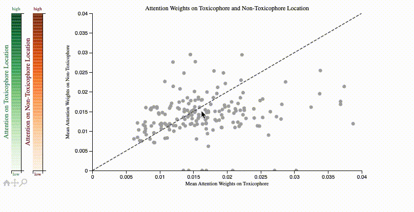

[](https://github.com/PaccMann/toxsmi/actions/workflows/build.yml)
[](https://opensource.org/licenses/MIT)

# toxsmi

PyTorch implementation of `toxsmi`, a package for toxicity prediction models
from SMILES.

## Training your own model

The library itself has few dependencies (see [setup.py](setup.py)) with loose requirements. 

### Setup
```sh
conda env create -f conda.yml
conda activate toxsmi
pip install -e .
```

### Start a training

In the `scripts` directory is a training script [train_tox.py](./scripts/train_tox.py) that makes use
of `toxsmi`.

Download sample data from the Tox21 database and store it in a folder called `data`
[here](https://ibm.box.com/s/kahxnlg2k2s0x3z0r5fa6y67tmfhs6or). 

```console
(toxsmi) $ python3 scripts/train_tox.py data/tox21_train.csv \
data/tox21_score.csv data/tox21.smi data/smiles_language_tox21.pkl \
models params/mca.json test --embedding_path data/smiles_vae_embeddings.pkl
```

Type `python scripts/train_tox.py -h` for further help.

## Inference (using our pretrained models)
Several of our trained models are available via the [GT4SD](https://github.com/GT4SD), the Generative Toolkit for Scientific Discovery. See the paper [here](https://arxiv.org/abs/2207.03928).
We recommend to use [GT4SD](https://github.com/GT4SD/gt4sd-core) for inference. Once you install that library, use as follows:
```py
from gt4sd.properties import PropertyPredictorRegistry
tox21 = PropertyPredictorRegistry.get_property_predictor('tox21', {'algorithm_version': 'v0'})
tox21('CCO')
```

The other models are the SIDER model and the ClinTox model from the [MoleculeNet](https://moleculenet.org/datasets-1) benchmark:
```py
from gt4sd.properties import PropertyPredictorRegistry
sider = PropertyPredictorRegistry.get_property_predictor('sider', {'algorithm_version': 'v0'})
clintox = PropertyPredictorRegistry.get_property_predictor('clintox', {'algorithm_version': 'v0'})
print(f"SIDE effect predictions: {sider('CCO')}")
print(f"Clinical toxicitiy predictions: {clintox('CCO')}")
```

## Attention visualization
ToxSmi uses a self-attention mechanism that can highlight chemical motifs used for the predictions.
In [notebooks/toxicity_attention.ipynb](notebooks/toxicity_attention.ipynb) we share a tutorial on how to create such plots:



## Citation
If you use `toxsmi` in your projects, please (temporarily) cite the following (full paper in review):

```bib
@inproceedings{markert2020chemical,
  title={Chemical representation learning for toxicity prediction},
  author={Markert, Greta and Born, Jannis and Manica, Matteo and Schneider, Gisbert and Rodriguez Martinez, M},
  booktitle={PharML Workshop at ECML-PKDD (European Conference on Machine Learning and Principles and Practice of Knowledge Discovery in Databases)},
  year={2020}
}
```