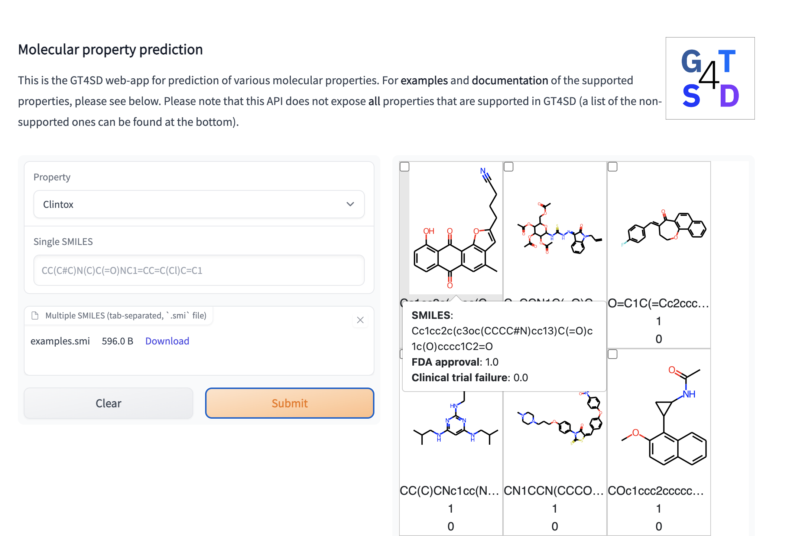

[](https://github.com/PaccMann/toxsmi/actions/workflows/build.yml)
[](https://opensource.org/licenses/MIT)
[](https://github.com/psf/black)
[](https://huggingface.co/spaces/GT4SD/molecular_properties)

## Chemical Representation Learning for Toxicity Prediction

PyTorch implementation related to the paper *Chemical Representation Learning for Toxicity Prediction* ([Born et al, 2023, *Digital Discovery*](https://pubs.rsc.org/en/content/articlehtml/2023/dd/d2dd00099g)).

# Inference
We released pretrained models for the Tox21, the ClinTox and the SIDER dataset.

## Demo with UI
🤗 A gradio demo with a simple UI is available on [HuggingFace spaces](https://huggingface.co/spaces/GT4SD/molecular_properties)


## Python API
The pretrained models are available via the [GT4SD](https://github.com/GT4SD), the Generative Toolkit for Scientific Discovery. See the paper [here](https://arxiv.org/abs/2207.03928).
We recommend to use [GT4SD](https://github.com/GT4SD/gt4sd-core) for inference. Once you install that library, use as follows:
```py
from gt4sd.properties import PropertyPredictorRegistry
tox21 = PropertyPredictorRegistry.get_property_predictor('tox21', {'algorithm_version': 'v0'})
tox21('CCO')
```

The other models are the SIDER model and the ClinTox model from the [MoleculeNet](https://moleculenet.org/datasets-1) benchmark:
```py
from gt4sd.properties import PropertyPredictorRegistry
sider = PropertyPredictorRegistry.get_property_predictor('sider', {'algorithm_version': 'v0'})
clintox = PropertyPredictorRegistry.get_property_predictor('clintox', {'algorithm_version': 'v0'})
print(f"SIDE effect predictions: {sider('CCO')}")
print(f"Clinical toxicitiy predictions: {clintox('CCO')}")
```


# Training your own model

### Setup
The library itself has few dependencies (see [setup.py](setup.py)) with loose requirements. 
```sh
conda env create -f conda.yml
conda activate toxsmi
pip install -e .
```

### Start a training

In the `scripts` directory is a training script [train_tox.py](./scripts/train_tox.py).

Download sample data from the Tox21 database and store it in a folder called `data`
[here](https://ibm.box.com/s/kahxnlg2k2s0x3z0r5fa6y67tmfhs6or). 

```console
(toxsmi) $ python3 scripts/train_tox.py \
--train data/tox21_train.csv \
--test data/tox21_score.csv \
--smi data/tox21.smi \
--params params/mca.json \
--model path_to_model_folder \
--name debug
```

**Features**:
- Set ```--finetune``` to the path to a `.pt` file to start from a pretrained model
- Set ```--embedding_path``` to the path of pretrained embeddings

Type `python scripts/train_tox.py -h` for further help.

### Evaluate a model
In the `scripts` directory is an evaluation script [eval_tox.py](./scripts/eval_tox.py).
Assume you have a trained model, use as follows:

```console
(toxsmi) $ python3 scripts/eval_tox.py \
-model path_to_model_folder \
-smi data/tox21.smi \
-labels data/tox21_test.csv \
-checkpoint RMSE"
```

where `-checkpoint` specifies which `.pt` file to pick for the evaluation (based on substring matching)

## Attention visualization
The model uses a self-attention mechanism that can highlight chemical motifs used for the predictions.
In [notebooks/toxicity_attention.ipynb](notebooks/toxicity_attention.ipynb) we share a tutorial on how to create such plots:


## Citation
If you use this code in your projects, please cite the following:

```bib
@article{born2023chemical,
    author = {Born, Jannis and Markert, Greta and Janakarajan, Nikita and Kimber, Talia B. and Volkamer, Andrea and Martínez, María Rodríguez and Manica, Matteo},
    title = {Chemical representation learning for toxicity prediction},
    journal = {Digital Discovery},
    year = {2023},
    pages = {-},
    publisher = {RSC},
    doi = {10.1039/D2DD00099G},
    url = {http://dx.doi.org/10.1039/D2DD00099G}
}
```
